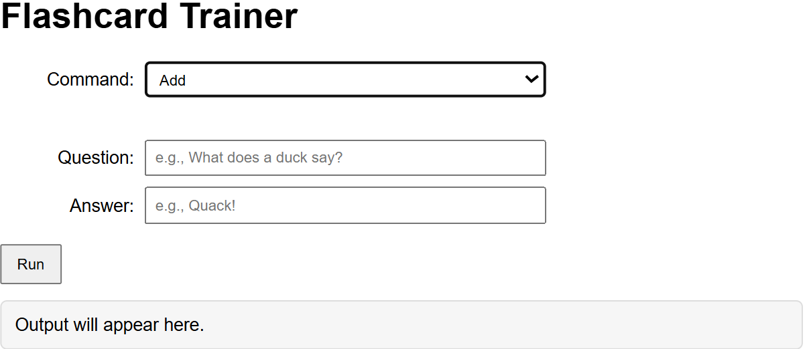
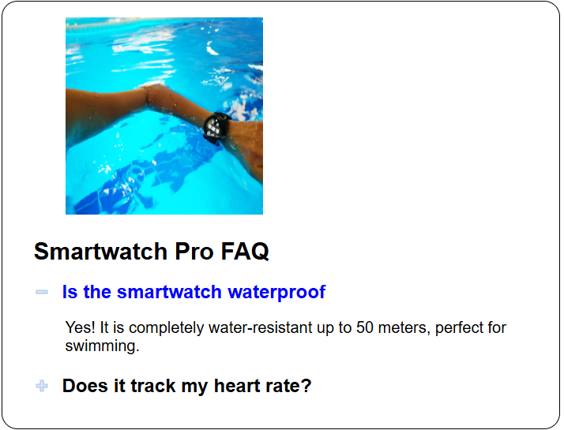
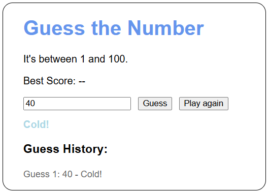
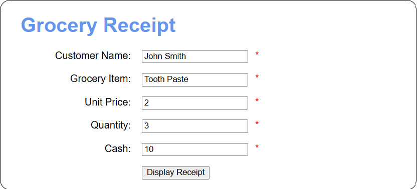
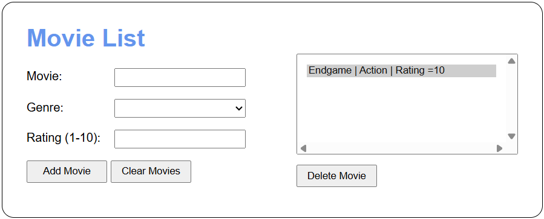

# 🚀 Developer Portfolio: Gateway

> Hi! And welcome to my Developer Portfolio! This is the place you want to come to when you are looking for my work! Down below, I have listen the title of my repositories, the technology I used to create them, and which class I created it for! I hope this is a useful tool! Thanks!

---

## 🛠️ Project Overview

| Repository | Primary Tech | Category |
| :--- | :--- | :--- |
| ♦️ [Flashcards](#flashcards) | **JavaScript** | CSC465: Advanced Web Development |
| ❓ [FAQs](#faqs) | **JavaScript** | CSC465: Advanced Web Development |
| 🌡️ [JS Hot/Cold Game](#js-hot-cold-game) | **JavaScript** | CSC465: Advanced Web Development |
| 🧾 [JS Grocery Receipt](#js-grocery-receipt) | **JavaScript** | CSC465: Advanced Web Development |
| 🎬 [Movie List](#movie-list) | **JavaScript** | CSC465: Advanced Web Development |

---

## 📂 My Project Details

### Flashcards
* **Short summary:** Flashcards that can be used to study! Create flashcards or remove them! You also have
* different options you can select like list flashcards or clear flashcards.
* **Technologies used:**  
* **Key concepts learned:** Learned how to manipulate strings and arrays. Learned how to make switches.
* **Project status:** ✅Complete
* **Course or self project:** Course project

> *Project link: Here is the <a href="https://github.com/Pirategirl9000/Flashcards">link</a>*

---

### FAQs
* **Short summary:** Frequently asked questions about a smartwatch. This program displays information about the smartwatch.
* and it changes pictures depending on the faq selected.
* **Technologies used:**  
* **Key concepts learned:** Learned how to store h2 elements inside an h2 array. How to use toggle function.
* **Project status:** ✅Complete
* **Course or self project:** Course project

> *Project link: Here is the <a href="https://github.com/rnegrete01/faqs" height="200" width="200">link</a>*

---

### JS Hot/Cold Game
* **Short summary:** This program generates a random number that the user must guess. The text on the screen
* changes depending on how far or close the user is to the number. This program also projects the user's guess history.
* **Technologies used:**  
* **Key concepts learned:** Arrow functions, how to update a best score.
* **Project status:** ✅Complete
* **Course or self project:** Course project

> *Project link: Here is the <a href="https://github.com/rnegrete01/js_hot_cold_game" height="200" width="200">link</a>*

---

### JS Grocery Receipt
* **Short summary:** A simple program that acts as a self-checkout register. It has many required fields for the user to fill. The result is an alert that displays a receipt.
* **Technologies used:**  
* **Key concepts learned:** How to use alerts, how to use event handlers, how to use listeners
* **Project status:** ✅Complete
* **Course or self project:** Course project

> *Project link: Here is the <a href="https://github.com/rnegrete01/js_grocery_receipt">link</a>*

---

### Movie List
* **Short summary:** A program that simulates a personal list of movies. The user can enter the movie's title, genre, and rating. It sorts
* the user's movies alphabetically. If the user wishes to remove a movie, they can select one and remove it. Otherwise, they can clear their list entirely. The list stores itself in local storage.
* **Technologies used:**  
* **Key concepts learned:** How to create a class in JS, how to create functions, how to save and load data from local storage.
* **Project status:** ✅Complete
* **Course or self project:** Course project

> *Project link: Here is the <a href="https://github.com/rnegrete01/movie_list">link</a>*

---
